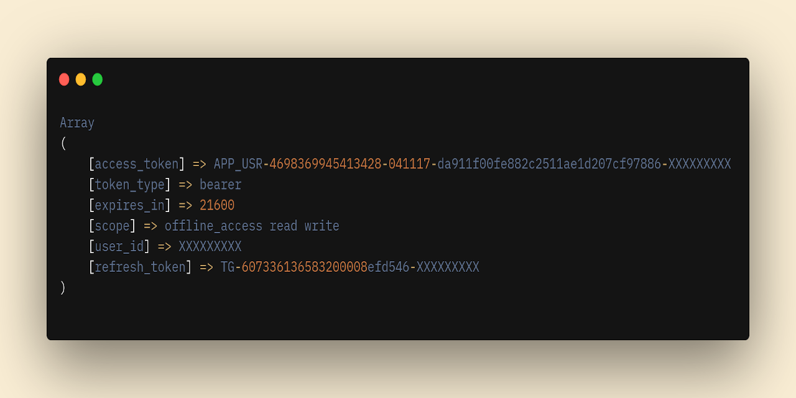

<p align="center">
	
</p>


### mini-meli

[](https://packagist.org/packages/tepuilabs/mini-meli)
[](https://packagist.org/packages/tepuilabs/payment-processors)


genera acces token de mercado libre.


la idea de esto es poder generar access token para poder tener acceso a los recursos de Mercadolibre.


### como usar


usando composer

```bash
composer require tepuilabs/mini-meli
```

primer necesitamos crear un archivo `.env` con lo siguiente:

```yml
GRANT_TYPE=authorization_code
CLIENT_ID=
CLIENT_SECRET=
REDIREC_URL=http://localhost:9000
```

> NOTA: estos datos los debes configurar en mercado libre cuando crees una applicación, los unicos datos que necesitas son el client id / secret


luego necesitas configurar algo como lo siguiente:

```php
<?php

use DevCoder\DotEnv;
use Abr4xas\Utils\PrettyPrintArray;
use Tepuilabs\MiniMeLi\MeliServices;

require 'vendor/autoload.php';


(new DotEnv(__DIR__ . '/.env'))->load();


$params = [
    'grant_type' => getenv('GRANT_TYPE'),
    'client_id' => getenv('CLIENT_ID'),
    'code' => $_GET['code'],
    'client_secret' => getenv('CLIENT_SECRET'),
    'redirect_uri' => getenv('REDIREC_URL')
];


$response = (new MeliServices($params))->generateAccessToken();


PrettyPrintArray::prettyPrintArray($response);
```